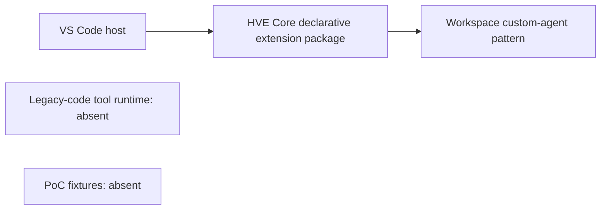
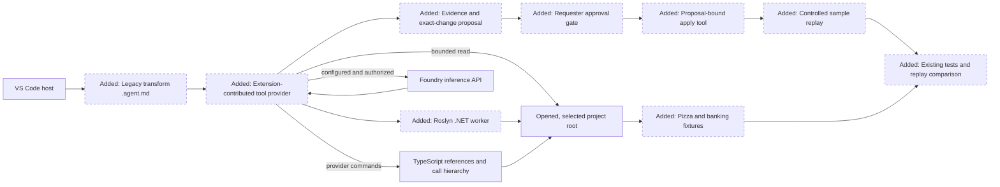

<!-- markdownlint-disable-file -->

# RPI Plan: Legacy Code Transformation Agent PoC

## Task Metadata

* Task ID: RPI-LCTA-2026-10-07
* Task slug: legacy-code-transformation-agent
* Plan date: 2026-10-07
* Decision participation: agent-owned, automatic RPI Agent context

## Executive Summary

The plan will build a contained VS Code proof of concept that analyzes a selected legacy function or class, produces a source-grounded proposal, waits for approval of the exact change, and then compares tests and representative runs before and after. The first slice is the .NET 10 pizza eligibility sample; Node.js 24.19 banking transfer follows. Java remains deferred.

* Bottom line: implementation planning is underway from completed RPI research; no product source code has been changed.
* Why this matters: an inheriting developer needs evidence-backed context and a behavior-checked proposal before modifying difficult code.
* Planning result: P01, P02-T01, and P02-T02 are complete. P02-T03 is in progress with a local proposal validator and Markdown renderer; the Foundry adapter, evidence wiring, and report writer remain.
* Confidence and uncertainty: worker compilation, syntax parsing, external-reference rejection, root-filtered results, and the Node-launched controlled-fixture discovery path are validated. The VS Code development-host interaction still needs a manual smoke test; arbitrary project loading stays gated.

### What You May Not Know

* The existing HVE Core extension is declarative packaging, not an executable runtime. The PoC should live in a separate demo area and must not silently change the HVE Core extension packaging pipeline.
* The selected project root must be an opened VS Code workspace folder for language-provider/project loading. The analysis tool must reject or stop on external project references instead of reading beyond the selected root.
* Roslyn 5.9.0 executes design-time `Compile`/`CoreCompile` targets in a separate BuildHost process. This is not a sandbox. C# provider and MSBuild calls now require extension-owned confirmation; declining runs syntax-only parsing and bounded text search, with semantic references unresolved.
* A real Foundry invocation requires a configured endpoint/model, endpoint-appropriate authentication, and confirmation that sending the supplied source context is allowed. The plan can implement the adapter and mocked contract tests without accessing credentials or making a live request.
* VS Code references and representative test runs do not prove a complete dynamic call graph or equivalence for every possible input.

## Phase Checklist

### Before



### After



The current repository has agent customization and a declarative extension package, but no transformation runtime or sample fixtures. The intended result adds a separate PoC workspace, keeps discovery read-only, and makes approval and behavior replay explicit stages.

<!-- rpi:phase id=P01 -->
### [x] P01: Establish the .NET baseline

Goals:
* Create a self-contained PoC workspace and behavior-correct pizza fixture so later analysis and replay have a stable baseline.

Dependencies:
* None.


Highlighted work: create the separate demo workspace and the pizza fixture/test baseline.

<!-- rpi:task id=P01-T01 -->
#### [x] P01-T01: Create the standalone PoC workspace

Goals:
* Provide a runnable VS Code extension scaffold with a bundled custom-agent definition so later phases can add tools without changing HVE Core's declarative extension package.

Requirements:
* FR-001, NFR-001, NFR-002.
* Keep the runtime under `demos/legacy-code-transformation/extension/`; do not add artifacts to HVE Core's root `.github`, root `plugin.json`, or `extension/` packaging.
* Bundle the `.agent.md` through the extension's `contributes.chatAgents` path.
* Open each selected fixture project folder as the VS Code workspace root; load the extension separately in the extension-development host.
* For the early demo, make the agent manually invokable with only the bounded discovery and source-evidence tools. Keep automatic model invocation disabled; expose no Foundry, edit, or execution tools.

Details:
* Create the custom agent at `demos/legacy-code-transformation/extension/agents/legacy-code-transformation.agent.md` and bundle it with the extension. Keep the current preview explicitly read-only and label its limitations; the full proposal and apply workflow remains unavailable.
* Keep the demo self-contained. Do not alter the HVE Core release, plugin synchronization, extension packaging, or documentation-generation pipelines.

References:
* [extension/PACKAGING.md](../../../extension/PACKAGING.md): confirms the current extension folder is declarative packaging.
* [.copilot-tracking/research/2026-10-07/legacy-code-transformation-agent-research.md](../../research/2026-10-07/legacy-code-transformation-agent-research.md): W8-W10, W16, C1-C3, and C5 establish the agent/tool/runtime and plugin-root boundaries.
* [VS Code contribution points](https://code.visualstudio.com/api/references/contribution-points): `contributes.chatAgents` bundles an `.agent.md` from inside an extension.
* [scripts/plugins/Sync-PluginManifest.ps1](../../../scripts/plugins/Sync-PluginManifest.ps1): plugin membership starts from tracked files under root `.github`.

Dependencies:
* None.

<!-- rpi:task id=P01-T02 -->
#### [x] P01-T02: Establish pizza behavior baselines

Goals:
* Make the .NET pizza eligibility behavior reproducible before any analysis or transformation is attempted.

Requirements:
* FR-006, NFR-004.
* Target .NET 10 and preserve the confirmed rules: members receive 10% off; non-members receive 10% off at subtotal greater than or equal to $50; otherwise no discount.
* Include a member case below the threshold, a non-member case at $49.99, a non-member case at exactly $50.00, and an above-threshold case with deterministic expected outputs.

Details:
* Use an intentionally difficult but correct fixture, and keep its test harness separate from the future Roslyn/tool implementation.
* Capture baseline outputs and the existing test command/result without invoking arbitrary user projects.

References:
* [.copilot-tracking/dt/getting-started/method-01-scope/scope-boundaries.md](../../dt/getting-started/method-01-scope/scope-boundaries.md): confirmed pizza behavior and first-slice priority.
* [.copilot-tracking/research/2026-10-07/legacy-code-transformation-agent-research.md](../../research/2026-10-07/legacy-code-transformation-agent-research.md): Q6 and W15 constrain repeatability and execution trust.

Dependencies:
* P01-T01.

<!-- rpi:phase id=P02 -->
### [ ] P02: Build bounded discovery and proposal reporting

Goals:
* Produce a read-only, source-grounded proposal for the selected .NET function while enforcing the supplied project-root boundary.

Dependencies:
* P01.


Highlighted work: implement the read-only tool path, Roslyn analysis, Foundry adapter, and evidence report.

<!-- rpi:task id=P02-T01 -->
#### [x] P02-T01: Enforce project-root intake and bounded discovery

Goals:
* Restrict every file search and location returned to the selected, opened workspace folder and identify unsupported scope without reading outside it.

Requirements:
* FR-001, FR-002, NFR-001.
* Require a target path under the selected workspace root; canonicalize paths and validate every discovered URI against that root.
* Exclude dependencies/generated output by default while reporting the search boundary and exclusions.
* Fail closed or report an unresolved external project reference without reading outside the selected root.
* Provide a read-only `read_source_evidence` tool that accepts only normalized project-relative paths and line ranges, then revalidates the canonical URI before reading.

Details:
* Use VS Code workspace APIs for file discovery and language-provider commands. Keep bounded text search complementary to semantic results.
* Return target source spans and line-numbered text matches from discovery. Use `read_source_evidence` to retrieve focused test, README, and documentation excerpts after their paths/lines are known; do not return whole project files by default.
* Report language provider unavailable, project still loading, or no result as an evidence limitation, not proof of no callers.
* Record dynamic dispatch, reflection, delegates, generated code, and textual matches as unknown or unverified where applicable.

References:
* [.copilot-tracking/research/2026-10-07/legacy-code-transformation-agent-research.md](../../research/2026-10-07/legacy-code-transformation-agent-research.md): Q1, Q3-Q4; Findings on provider limits and root validation; W1, W9, W13-W14.
* [.copilot-tracking/dt/getting-started/method-01-scope/scope-boundaries.md](../../dt/getting-started/method-01-scope/scope-boundaries.md): project-folder-only discovery boundary.

Dependencies:
* P01-T01.

<!-- rpi:task id=P02-T02 -->
#### [x] P02-T02: Analyze .NET symbols with Roslyn

Goals:
* Resolve the selected C# target symbol in the loaded .NET 10 project and return source references with exact file and location evidence.

Requirements:
* FR-002, NFR-001.
* Use Roslyn MSBuild Workspaces and C# workspace support compatible with .NET 10.
* Restrict reported reference locations to the selected root and distinguish direct references from caller edges that could not be resolved.
* Surface solution-load diagnostics and unsupported project cases instead of silently claiming completeness.

Details:
* Implement an extension-owned confirmation before invoking `MSBuildWorkspace` or C# language-provider commands that may load an arbitrary project. State that project evaluation and design-time `Compile`/`CoreCompile` targets may invoke custom tasks; do not imply that the separate BuildHost is a sandbox.
* If confirmation is declined, do not invoke MSBuild Workspace or C# project-loading provider commands. Use syntax-only Roslyn parsing, bounded text search, and any editor-provider results already available; mark project-semantic references unresolved and do not present the fallback as equivalent.
* For the early demo, expose the agent only for manual invocation with the two read-only discovery/evidence tools. It must summarize collected evidence and unknowns, not create an edit proposal or claim validation. Keep Foundry, source mutation, and project execution unavailable.
* Before `MSBuildWorkspace` opens the selected project, preflight explicit project references, source includes, imports, and task-assembly paths. Reject paths that escape the selected root or cannot be proven static; report the reason and return syntax-only evidence instead.
* Use the current Roslyn package evidence from research as the starting point. The 5.9.0 source confirms `OpenSolutionAsync` and the design-time build path; test loading only against the controlled pizza fixture during the PoC.
* Do not describe `FindReferencesAsync` results as a complete dynamic call graph. Pair them with the bounded text/context search in P02-T01.

Validation:
* Build the extension-owned worker for `net10.0`.
* Test syntax-only fallback and root-preflight rejection.
* Run discovery through the Node launcher on the controlled pizza fixture and verify the target method and in-root reference.
* Keep the VS Code development-host interaction as a manual smoke check; do not claim arbitrary project compatibility.

References:
* [.copilot-tracking/research/2026-10-07/legacy-code-transformation-agent-research.md](../../research/2026-10-07/legacy-code-transformation-agent-research.md): Q2, Q8; Roslyn findings; W4-W5, W12, W17-W22; Cycle 2 consent/fallback decision.

Dependencies:
* P02-T01.

<!-- rpi:task id=P02-T03 -->
#### [ ] P02-T03: Generate a structured proposal report

Goals:
* Produce a reviewable Markdown report that separates source evidence, observed behavior, explanation, and exact proposed changes.

Requirements:
* FR-002, FR-003, FR-004.
* Include cited callers/references, tests, surrounding source, README/docs, original-run inputs/outputs, affected files, exact proposed edits, helper extractions, and unresolved unknowns.
* Store the report under `reports/legacy-code-transformation/` inside the selected root; do not edit source while producing the report.
* Validate the model response against a structured schema before rendering or making it available for approval.
* Validate every model-provided evidence path/range against tool-collected evidence and every proposed change path against the selected root; reject invented citations or out-of-root changes.
* Keep live Foundry invocation disabled until endpoint/model configuration and permission to send the supplied source context are confirmed.
* Keep the early demo agent limited to manual, read-only discovery. Do not present it as the proposal or apply workflow planned for P02-T03/P03.

The model proposal shape is a contract; the tool validates it before it may become an approval candidate:

```json
{
	"type": "object",
	"additionalProperties": false,
	"required": ["summary", "target", "evidence", "changes", "unknowns"],
	"properties": {
		"summary": { "type": "string" },
		"target": {
			"type": "object",
			"additionalProperties": false,
			"required": ["path", "symbol"],
			"properties": {
				"path": { "type": "string" },
				"symbol": { "type": "string" }
			}
		},
		"evidence": {
			"type": "array",
			"items": {
				"type": "object",
				"additionalProperties": false,
				"required": ["id", "path", "startLine", "endLine", "claim"],
				"properties": {
					"id": { "type": "string" },
					"path": { "type": "string" },
					"startLine": { "type": "integer", "minimum": 1 },
					"endLine": { "type": "integer", "minimum": 1 },
					"claim": { "type": "string" }
				}
			}
		},
		"changes": {
			"type": "array",
			"items": {
				"type": "object",
				"additionalProperties": false,
				"required": ["path", "originalText", "replacementText", "rationale"],
				"properties": {
					"path": { "type": "string" },
					"originalText": { "type": "string" },
					"replacementText": { "type": "string" },
					"rationale": { "type": "string" }
				}
			}
		},
		"unknowns": { "type": "array", "items": { "type": "string" } }
	}
}
```

Details:
* Use the direct Foundry v1 API behind an isolated adapter. Keep request construction and credentials out of the agent Markdown file.
* Use a test double for local tests. The API/auth implementation must follow the selected endpoint family's current documentation; do not guess the Entra token audience.
* Populate observed behavior and test results from the controlled runner/test process, never from model-generated claims.
* Retrieve relevant test/documentation excerpts through `read_source_evidence`; validate each citation path and line range against tool-collected evidence before rendering.
* The report path is a planning choice intended to keep generated evidence separate from source files; expose it as a configurable override if it conflicts with an existing project convention.

Guidance:
* `demos/legacy-code-transformation/extension/src/proposal-contract.js` exports `PROPOSAL_SCHEMA`, `validateProposal`, and `renderProposalReport`. It validates citations against an evidence catalog, binds the proposal to the selected target when supplied, and does not write files or call Foundry.
* Focused contract tests are in `demos/legacy-code-transformation/extension/tests/proposal-contract.test.js`.

References:
* [.copilot-tracking/research/2026-10-07/legacy-code-transformation-agent-research.md](../../research/2026-10-07/legacy-code-transformation-agent-research.md): Q5-Q6; Foundry and report findings; W6-W10, W15.
* [.copilot-tracking/dt/getting-started/method-01-scope/scope-boundaries.md](../../dt/getting-started/method-01-scope/scope-boundaries.md): pre-edit report and approval contract.

Dependencies:
* P01-T02, P02-T01, P02-T02.

<!-- rpi:phase id=P03 -->
### [ ] P03: Enforce approval and verify the .NET change

Goals:
* Apply only the exact approved proposal and compare the transformed pizza fixture against its existing tests and original representative runs.

Dependencies:
* P02.


Highlighted work: bind approval to the proposal, apply only listed edits, and compare the same .NET tests and inputs.

<!-- rpi:task id=P03-T01 -->
#### [ ] P03-T01: Bind edits to an approved proposal

Goals:
* Prevent source changes unless the requester confirms the exact current proposal and ensure the apply operation cannot add unlisted edits.

Requirements:
* FR-003, FR-005, NFR-002.
* Keep discovery tools read-only and do not expose a generic source-edit operation to the analysis agent.
* Bind the apply request to a proposal identifier/content hash and source-file hashes; reject stale proposals or changed source.
* Require an extension-owned confirmation for every application, independent of agent tool auto-approval settings; bind that confirmation to the proposal ID, source hashes, and exact diff.
* Set the bundled agent `user-invocable: true` only after the apply tool and its confirmation checks are available.
* Add the apply tool to the custom agent only after this gate is implemented.
* Show the exact affected files and edits in the confirmation before application. Cancel must leave all source files unchanged.
* Apply only the approved edits and stop for a revised report/fresh approval if changes are needed beyond them.

Details:
* Keep approval state and proposed patches structured and immutable for the duration of the workflow. A generic tool invocation confirmation is not sufficient because tool approvals can be configured; the extension-owned confirmation and proposal hash are required for each write.
* Cover approved apply, cancelled apply with no changes, stale proposal, and changed-source rejection in the extension-tool suite.
* Keep the existing user requirement that report approval precedes code edits.

References:
* [.copilot-tracking/research/2026-10-07/legacy-code-transformation-agent-research.md](../../research/2026-10-07/legacy-code-transformation-agent-research.md): approval finding and W9; user scope evidence C4.
* [.copilot-tracking/dt/getting-started/method-01-scope/scope-boundaries.md](../../dt/getting-started/method-01-scope/scope-boundaries.md): exact approval and fresh-approval rules.

Dependencies:
* P02-T03.

<!-- rpi:task id=P03-T02 -->
#### [ ] P03-T02: Replay and compare the .NET fixture

Goals:
* Demonstrate that the approved pizza refactor passes the same existing tests and representative inputs captured against the original fixture.

Requirements:
* FR-006, NFR-004.
* Run only the controlled fixture/test harness in this PoC; do not run arbitrary project build targets as part of discovery.
* Compare each original and transformed output, error, and observable side effect; report uncovered behavior as unknown.
* Leave the source unchanged when tests or replay indicate a behavior difference, and produce a revised proposal rather than applying a fix outside approval.

Details:
* Use the baseline from P01-T02 and preserve the exact representative input set across both versions.

References:
* [.copilot-tracking/research/2026-10-07/legacy-code-transformation-agent-research.md](../../research/2026-10-07/legacy-code-transformation-agent-research.md): Q6 and Contrarian finding on test evidence versus proof.
* [.copilot-tracking/dt/getting-started/method-01-scope/scope-boundaries.md](../../dt/getting-started/method-01-scope/scope-boundaries.md): post-approval test/replay requirements.

Dependencies:
* P01-T02, P03-T01.

<!-- rpi:phase id=P04 -->
### [ ] P04: Add the Node.js transfer slice

Goals:
* Demonstrate the same bounded discovery, proposal, approval, and replay workflow for the Node.js 24.19 banking transfer fixture after the .NET slice is stable.

Dependencies:
* P03.


Highlighted work: add the Node fixture, verify the TypeScript provider path, and replay each case from reset account state.

<!-- rpi:task id=P04-T01 -->
#### [ ] P04-T01: Add Node transfer discovery and fixture

Goals:
* Resolve references/call hierarchy for the selected JavaScript target when the provider is available and establish deterministic banking behavior cases.

Requirements:
* FR-001, FR-002, FR-007, NFR-001, NFR-004.
* Target Node.js 24.19. Preserve the confirmed rules: both accounts exist and differ; amount is positive; source funds are sufficient; rejected transfers return a reason and leave balances unchanged.
* Configure an explicit JavaScript project when needed and report provider unavailability or unresolved dynamic references.
* Cover successful transfer and every confirmed rejection case.

Details:
* Use the VS Code TypeScript provider commands only after the target root is open and project loading is complete. Do not assume the target's Node runtime version determines the installed TypeScript service version.

References:
* [.copilot-tracking/research/2026-10-07/legacy-code-transformation-agent-research.md](../../research/2026-10-07/legacy-code-transformation-agent-research.md): Q3; W13-W14; provider version/capability limitations.
* [.copilot-tracking/dt/getting-started/method-01-scope/scope-boundaries.md](../../dt/getting-started/method-01-scope/scope-boundaries.md): Node transfer contract and deferred Java support.

Dependencies:
* P03.

<!-- rpi:task id=P04-T02 -->
#### [ ] P04-T02: Complete the integrated PoC handoff

Goals:
* Make the two-slice PoC repeatable for a reviewer and document its supported boundaries, setup, report path, and prerequisites.

Requirements:
* FR-001 through FR-007, NFR-001 through NFR-004.
* The demo README explains how to open the sample workspace, run the fixture tests, use the agent, and review/apply an approved proposal.
* State the Foundry live-call prerequisites and keep source-data permission, endpoint/model configuration, and credentials outside tracked artifacts.
* Summarize known limits: no complete dynamic call graph, no formal equivalence proof, no Java support, and no unrestricted arbitrary-project execution.

Details:
* Perform an end-to-end manual smoke in the VS Code extension development host: discovery report, explicit approval, exact edit application, and before/after test/replay for .NET and Node.
* Do not add the demo runtime to HVE Core plugin membership or VSIX packaging unless separately planned and approved.

References:
* [.copilot-tracking/research/2026-10-07/legacy-code-transformation-agent-research.md](../../research/2026-10-07/legacy-code-transformation-agent-research.md): recommendation, risks, and Planning Readiness gates.
* [extension/PACKAGING.md](../../../extension/PACKAGING.md): packaging boundary.

Dependencies:
* P01-T01, P01-T02, P02, P03, and P04-T01.

## User Decisions and Requirements

### Confirmed User Direction

* Continue the non-standard DT-to-RPI handoff as a technical feasibility PoC; Methods 2-6 and real-user demand validation remain skipped/out of scope.
* Start with .NET 10 pizza eligibility: members receive 10% off; non-members receive the same discount when subtotal is at least $50; otherwise no discount. The Node.js 24.19 banking transfer demo is second; Java is deferred.
* The requester supplies a project-folder path plus target file and function/class. Discovery stays within that root and cites callers, tests, surrounding code, README/docs, and observed input/output evidence. Unresolved dynamic references are reported as unknown.
* Generate a Markdown analysis/proposal report before code edits. The requester approves the exact listed changes; any unlisted change requires a revised proposal and fresh approval.
* After approval, apply only the approved changes, run existing tests, and replay the same representative inputs. Reset banking state for each input case.
* Use a Foundry-backed LLM API call without provisioning a Foundry resource. Do not access or store credentials in planning artifacts.

### Planning Decisions and Feedback

| Group | Decision or feedback item | Status | Owner | Rationale or input needed | Evidence | Planning impact |
| --- | --- | --- | --- | --- | --- | --- |
| D1 | Use a small VS Code extension-contributed tool provider for executable workspace/language-provider operations; keep the custom agent declarative. | Resolved | Agent | Extension tools directly use VS Code workspace APIs and commands. MCP remains an alternative if cross-editor reuse becomes a requirement. | RPI research W8-W10; extension/PACKAGING.md | Shapes the runtime boundary and separate demo location. |
| D2 | Require the selected project root to be an opened workspace folder and fail closed on external project references. | Resolved | Agent | C# Dev Kit and TypeScript services load workspace/project context; explicit validation is required to preserve the user-supplied root boundary. | RPI research W3, W9, W12-W14 | Adds root/URI boundary checks and an external-reference validation gate. |
| D3 | Use a configurable Foundry v1 REST adapter with API-key auth stored in VS Code SecretStorage; keep live calls disabled until endpoint/model and source-data permission are confirmed. | Resolved for the PoC adapter | Agent | The API-key route is documented and avoids choosing an Entra audience before the endpoint family is known. The user has not authorized sending non-demo code. | RPI research W6-W7, W9; RPI research Q5 | Supports mock tests and configurable live use without recording credentials or invoking an unknown deployment. |
| D4 | Bundle the agent through the standalone demo extension's `contributes.chatAgents` path; keep runtime and fixtures separate from HVE Core's plugin packaging. | Resolved | Agent | VS Code supports extension-bundled agents, while HVE plugin discovery is rooted in tracked `.github` paths. | RPI research W16, C1-C2, C5; extension/PACKAGING.md | Avoids HVE plugin membership changes and keeps the agent/tool runtime together. |
| D5 | Write generated reports under `reports/legacy-code-transformation/` in the selected project root by default, with a configurable destination. | Resolved | Agent | Keeps the pre-edit report separate from source files while preserving the user-supplied project-root boundary. | Confirmed report-before-edit workflow; RPI research C4 | Defines report output without editing source before approval. |

## Planning Readiness and Next Step

| Field | Record |
| --- | --- |
| Planning execution and readiness | Complete; P01 is complete and P02 is ready to begin, with root/provider/execution and live-Foundry gates explicit. |
| Decision participation | Agent-owned; automatic RPI Agent context. |
| Blockers | No planning blocker. Live Foundry invocation remains gated on endpoint/auth configuration and permission to send non-demo source. |
| Latest critique | [.copilot-tracking/reviews/plans/2026-10-07/legacy-code-transformation-agent-plan-critique-3.md](../../reviews/plans/2026-10-07/legacy-code-transformation-agent-plan-critique-3.md), Pass. |
| Relevant research | [.copilot-tracking/research/2026-10-07/legacy-code-transformation-agent-research.md](../../research/2026-10-07/legacy-code-transformation-agent-research.md) |
| Plan | `.copilot-tracking/plans/2026-10-07/legacy-code-transformation-agent-plan.md` |
| Changes-record role | `.copilot-tracking/changes/2026-10-07/legacy-code-transformation-agent-changes.md` will be implementation evidence. |
| Continuation owner | Active automatic RPI Agent. |
| Required gates or confirmations | Root confinement; controlled .NET original/refactored replay; installed TypeScript provider smoke test; proposal-bound approval; source-data permission and endpoint-specific authentication before live Foundry invocation. |
| Next action | Active automatic RPI Agent continues with P02-T02; live Foundry invocation remains gated on endpoint/model configuration and source-data permission. |

## Goals

* Deliver a working .NET-first PoC that grounds a refactoring proposal in source, callers/tests/docs, and observed behavior.
* Prevent source edits before explicit approval of the exact proposal, and prevent edits outside that proposal.
* Demonstrate the same report/approval/replay workflow on the Node transfer sample after the .NET slice.

## Scope and Non-Goals

### In Scope

* A separate demo workspace with extension-contributed VS Code tools, a Roslyn-backed .NET analysis helper, bounded workspace search, Foundry API adapter, report generation, approval-bound apply, and controlled sample replay.
* .NET 10 pizza eligibility first; Node.js 24.19 transfer second.
* Existing tests, representative fixture inputs, and explicit unknowns for unavailable providers or dynamic references.

### Non-Goals

* Changing HVE Core's existing declarative extension/VSIX packaging pipeline.
* Java support, architecture redesign, production hardening, service/resource provisioning, real-user demand validation, or unrestricted execution of arbitrary user projects.
* Claiming a complete call graph or formal proof of behavior equivalence.

### Change and Test Limits

* Canonical PoC source changes stay under `demos/legacy-code-transformation/`; remove or modify no existing HVE Core plugin, extension, agent, or test files.
* HVE Core test ownership is unchanged. Demo-owned coverage is limited to one .NET behavior suite, one extension-tool contract/integration suite, and one Node behavior/provider suite. Add cases only for confirmed behavior and material safety boundaries.
* The only runtime-generated artifact is the Markdown proposal report under the selected project's configured report directory. Do not commit build outputs or generated reports as fixtures.
* Existing tests plus semantic behavior and boundary tests are in scope; unrelated refactoring and broad hardening are not.

## Functional Requirements

* FR-001: Accept a project root, target file, and function/class; reject unsupported or ambiguous targets without editing source.
* FR-002: Discover source references/call sites, tests, surrounding source, README/docs, and representative observed behavior, with exact source locations and unknowns.
* FR-003: Produce a Markdown proposal before code edits, listing affected files and exact proposed changes.
* FR-004: Invoke a configurable Foundry model tool only when endpoint/auth settings and source-data permission are available; use a validated structured proposal contract.
* FR-005: Limit proposals to the selected function/class and any exact helper extraction described in the report; apply only the exact approved proposal and reject stale or unlisted changes.
* FR-006: Run the existing relevant tests and replay the same inputs before and after approved changes.
* FR-007: Add the Node transfer slice after the .NET slice, resetting account state for every replay case.

## Non-Functional Requirements

* NFR-001: No discovered file, language-provider result, project reference, or edit may escape the selected project root; unresolved external dependencies fail closed or are explicitly reported without reading them.
* NFR-002: Discovery is read-only. The apply operation is separate, proposal-bound, and requires confirmation that presents the exact change set.
* NFR-003: Secrets never appear in source, reports, logs, or tracking artifacts; live model invocation is blocked until endpoint-specific auth and data-handling permission are configured.
* NFR-004: Replay fixtures begin from a known state and capture inputs, outputs, errors, and side effects reproducibly.

## Risks and Open Questions

| Priority | Type | Risk, question, or planning item | Affected work | Impact | Smallest action or evidence needed | Owner |
| --- | --- | --- | --- | --- | --- | --- |
| High | Risk | Roslyn solution/project loading may resolve project references outside the selected root. | P02-T01, P02-T02 | Violates the user's explicit discovery boundary. | Fail closed on external project references; test canonicalized root and result URI filtering. | Planner/implementer |
| High | Risk | Running build/test targets or arbitrary selected code can execute project-controlled behavior. | P01-T02, P03-T02 | Potential local side effects and non-repeatable results. | Keep execution to controlled fixtures; require explicit approval and document the isolation boundary. | Planner/implementer |
| Medium | Open question | Installed C# and TypeScript language providers may be absent, loading, or capability-gated. | P02-T02, P04-T01 | Caller data may be incomplete. | Probe provider readiness and surface unavailable/incomplete evidence. | Implementer |
| Medium | User/environment prerequisite | Foundry endpoint/model deployment and source-code data policy are unspecified; API-key storage is the selected PoC auth path. | P02-T03 | Live invocation cannot be verified without environment configuration and authorization. | Implement configurable adapter with mocks; require endpoint/model and permission before live use. If the endpoint requires Entra, reopen D3 before implementation. | User/environment |

## Dependencies

* .NET 10 SDK and public NuGet access for Roslyn Workspaces packages.
* VS Code extension host and TypeScript language features for workspace commands/providers.
* Node.js 24.19 for the second demo fixture.
* Foundry endpoint/model/auth configuration and source-data permission only for a live invocation; mock transport is sufficient for local tests.

## Sources

* [.copilot-tracking/research/2026-10-07/legacy-code-transformation-agent-research.md](../../research/2026-10-07/legacy-code-transformation-agent-research.md): synthesized Wider, Deeper, and Contrarian evidence; planning readiness and gates.
* [.copilot-tracking/dt/getting-started/method-01-scope/scope-boundaries.md](../../dt/getting-started/method-01-scope/scope-boundaries.md): confirmed user problem, examples, root boundary, approval gate, and success criteria.
* [extension/PACKAGING.md](../../../extension/PACKAGING.md): existing extension is declarative packaging and should not be treated as an executable runtime.
* [scripts/plugins/Sync-PluginManifest.ps1](../../../scripts/plugins/Sync-PluginManifest.ps1): manifest synchronization is scoped to tracked files under root `.github`.
* [.github/agents/design-thinking/dt-coach.agent.md](../../../.github/agents/design-thinking/dt-coach.agent.md): workspace agent tool declarations and DT handoff context.
* [package.json](../../../package.json): available repository validation and test scripts; no project implementation command selected yet.
* [VS Code contribution points](https://code.visualstudio.com/api/references/contribution-points): the extension can contribute its bundled custom agent through `contributes.chatAgents`.

## Critique Disposition

* Critique setting and provenance: standard; default required by rpi-plan.
* Critique status: Complete.
* Latest critique and verdict: [.copilot-tracking/reviews/plans/2026-10-07/legacy-code-transformation-agent-plan-critique-3.md](../../reviews/plans/2026-10-07/legacy-code-transformation-agent-plan-critique-3.md), Pass.
* Earlier critiques: [.copilot-tracking/reviews/plans/2026-10-07/legacy-code-transformation-agent-plan-critique.md](../../reviews/plans/2026-10-07/legacy-code-transformation-agent-plan-critique.md), Revise; [.copilot-tracking/reviews/plans/2026-10-07/legacy-code-transformation-agent-plan-critique-2.md](../../reviews/plans/2026-10-07/legacy-code-transformation-agent-plan-critique-2.md), Pass.
* Limitations: critique uses supplied evidence only. Diagrams were not rendered in light/dark themes; runtime behavior remains unverified.

| Critique run and finding | Disposition | Action owner | Exact resolving evidence | Decision route | Plan response or residual risk |
| --- | --- | --- | --- | --- | --- |
| Initial standard PC-001, explicit human approval | Resolved; verified by follow-up Pass | Planning parent | Follow-up critique confirms P03-T01 requires extension-owned confirmation independent of tool auto-approval, exact proposal/source hashes, and cancel/stale-source tests. | Direct planner correction | Source edits require the extension-owned confirmation on every apply. |
| Initial standard PC-002, Foundry auth risk conflict | Resolved; verified by follow-up Pass | Planning parent | D3 and Risks and Open Questions select SecretStorage API-key handling while leaving endpoint/model/source permission as live-call prerequisites. | Direct planner correction | Risk row distinguishes the selected auth path from live-call prerequisites. |
| Follow-up standard critique, revised approval and auth boundaries | Pass; no new findings | Planning parent | .copilot-tracking/reviews/plans/2026-10-07/legacy-code-transformation-agent-plan-critique-2.md | No further revision required | Plan is ready for implementation; runtime gates remain explicit. |
| Post-critique packaging refinement: extension-contributed agent | Pass; no new findings | Planning parent | [.copilot-tracking/reviews/plans/2026-10-07/legacy-code-transformation-agent-plan-critique-3.md](../../reviews/plans/2026-10-07/legacy-code-transformation-agent-plan-critique-3.md) confirms W16/C5 supports the bundled-agent path. | No further revision required | P01 is complete; P02-T01 is eligible to proceed. |

## Artifact Self-Check

* [x] Executive Summary, What You May Not Know, and the Phase Checklist come first and are understandable without reading the supporting sections.
* [x] Confirmed direction, grouped decisions, readiness, goals, scope, requirements, risks, and dependencies are current and consistent with the Phase Checklist.
* [x] Planning decision participation and provenance are recorded; agent-owned choices have evidence-backed rationales or honest blockers.
* [x] Every FR/NFR is cited by at least one task's Requirements.
* [x] Every phase and task has the required labeled blocks and a current diagram.
* [x] Open decisions, risks, and questions name the affected Pxx-Txx.
* [x] Existing paths use correct workspace-relative links; not-yet-created paths remain in backticks.
* [x] Before is evidence-backed; After and phase diagrams use stable IDs and distinguish additions/removals.
* [x] Diagram initialization styling follows the planning reference; dual-theme rendering limitation is recorded because preview was unavailable.
* [x] Critique setting, status, findings, dispositions, readiness, continuation owner, gates, and next action are current.
* [x] Follow-Up Items remain outside active plan completion.
* Checked sections: task metadata, executive summary, phase/task blocks and diagrams, decisions, readiness, requirements, risks, critique dispositions, sources, and handoff.
* Missing or limited sections: diagrams were not rendered in light/dark themes; runtime behavior remains unverified until implementation.

## Follow-Up Items

* None

## Handoff

* Authoritative implementation handoff: Planning Readiness and Next Step.
