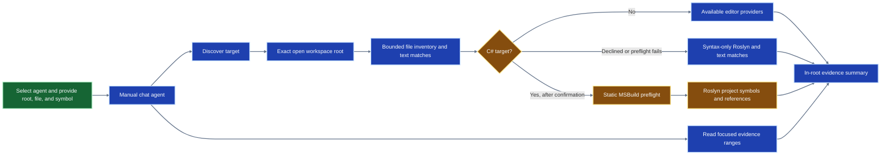

## Status

This is an in-progress technical proof of concept. The runnable sample is the .NET 10 pizza eligibility fixture. The Node.js banking-transfer sample, proposal report, Foundry integration, approval-bound edits, and complete agent workflow are not implemented yet.

The extension currently provides project-root-bounded discovery and focused source-evidence reads. For C# analysis, it asks for confirmation before invoking language providers or MSBuild. Declining uses syntax-only Roslyn parsing over source text already read inside the selected root. The separate Roslyn worker also has an MSBuild analysis path with static checks for explicit imports and out-of-root project, source, or task-assembly paths.

A local proposal-contract validator and Markdown renderer are also under development. They are not connected to the agent, a Foundry call, or a report-file writer yet.

The bundled chat agent is available for manual, read-only discovery with the two bounded tools. It does not call Foundry, create a refactor proposal, edit files, or run tests. The Node-launched MSBuild path has been exercised against the controlled pizza fixture; the VS Code development-host interaction still needs a manual smoke test. Do not use MSBuild analysis with arbitrary projects.

## Requirements

* VS Code 1.140 or later to run the extension development host
* .NET SDK 10 to build and run the pizza fixture and Roslyn worker
* Node.js 24.19 or later to run extension checks and tests

## Run The Pizza Fixture

From the repository root, run the existing tests:

```powershell
dotnet test demos/legacy-code-transformation/fixtures/dotnet/PizzaEligibility.sln --verbosity minimal
```

Run one pizza case with the same solution project:

```powershell
dotnet run --project demos/legacy-code-transformation/fixtures/dotnet/src/PizzaEligibility/PizzaEligibility.csproj -- 25.00 true
```

The command accepts `<subtotal> <isMember>` and prints the discount to two decimal places. The captured baseline cases are:

| Subtotal | Member | Discount |
| ---: | :---: | ---: |
| 25.00 | true | 2.50 |
| 49.99 | false | 0.00 |
| 50.00 | false | 5.00 |
| 75.00 | false | 7.50 |

## Check The Extension

From the extension directory, run the syntax and test checks:

```powershell
cd demos/legacy-code-transformation/extension
npm.cmd run check
npm.cmd test
```

The extension integration suite has 17 passing tests covering workspace-root validation, traversal and symlink rejection, filtered provider locations, focused evidence reads, confirmation behavior, Roslyn syntax fallback, static rejection of an external project reference, and Node-launched Roslyn discovery on the controlled pizza fixture. The separate proposal-contract test file has 6 passing tests.

To open an extension development host with the pizza fixture as its workspace root, run this from the repository root:

```powershell
code --extensionDevelopmentPath="${PWD}\demos\legacy-code-transformation\extension" "${PWD}\demos\legacy-code-transformation\fixtures\dotnet"
```

The fixture folder must be the opened workspace root for discovery. The extension source is outside that root. In the development host, select **Legacy Code Transformation Demo** from the agent picker and provide:

* Project root: the absolute path to `demos/legacy-code-transformation/fixtures/dotnet`
* Target file: the absolute path to `src/PizzaEligibility/PizzaDiscountCalculator.cs` under that root
* Target symbol: `CalculateDiscountAmount`

For a semantic preview of the controlled pizza fixture, choose **Continue with C# providers** when the confirmation appears. Roslyn will load that fixture and return the target and in-root references; editor-provider results may also be included when available. If you decline, the agent uses syntax-only parsing and bounded text matches instead.

You can then ask it to read focused test or caller excerpts from paths it found. Either way, the response is an evidence summary only, not a Foundry-generated proposal or validated refactor.

## Completed So Far

* Created a standalone VS Code extension and bundled the manually invokable, read-only demo agent without changing HVE Core plugin or VSIX packaging.
* Added the .NET pizza fixture, four behavior tests, and baseline CLI outputs.
* Added read-only discovery constrained to the exact opened workspace folder, plus a focused line-range source-evidence reader.
* Added an extension-owned C# analysis confirmation and a Roslyn syntax-only fallback when confirmation is declined.
* Added a .NET 10 Roslyn worker with syntax parsing, symbol-reference analysis, and static root-bound checks before MSBuild Workspace loading.
* Enabled the agent for manual use with only the two read-only tools; automatic invocation remains disabled.
* Verified the Node-launched worker and discovery flow against the controlled pizza project. Roslyn found `CalculateDiscountAmount` and its in-project caller.

## Still Needed

* Smoke-test the agent picker and confirmation modal in the opened VS Code development host. Automated tests cover the controlled Node-launched Roslyn path, but do not automate the chat UI.
* Connect the local proposal validator/renderer to gathered evidence and add a report writer. Implement and mock-test the Foundry adapter; live use needs endpoint/model configuration and permission to send source.
* Implement approval of the exact proposal and proposal-bound source application.
* Add controlled before/after replay, then build the Node.js banking-transfer fixture and validate its existing TypeScript language-provider path.
* Keep Java deferred until the .NET and Node.js slices are complete.

## Safety Boundaries

* Use only the controlled pizza fixture when exercising MSBuild loading. The VS Code development-host interaction still needs a manual smoke test.
* MSBuild design-time targets may invoke project-defined tasks. The separate BuildHost process is not a sandbox. Confirm before C# provider or MSBuild analysis.
* If confirmation is declined or root preflight rejects a project, report syntax-only results and text matches as lower-fidelity evidence; do not describe them as semantic references.
* Do not run arbitrary project tests or scripts as a behavior-capture harness. The demo's fixture tests are the approved runner so far.
* Do not send non-demo source to Foundry until its endpoint is configured and data-handling permission is confirmed.

## How The Workflow Works

### Current Read-Only Preview

The extension contributes the **Legacy Code Transformation Demo** agent to the VS Code agent picker. When the extension activates, it registers two language-model tools: `legacy_code_transformation_demo_discover_target` and `legacy_code_transformation_demo_read_source_evidence`. The agent is manually invoked, and its tool allowlist contains only these two tools. The registration lives in [`extension/src/extension.js`](extension/src/extension.js), while the agent instructions are in [`extension/agents/legacy-code-transformation.agent.md`](extension/agents/legacy-code-transformation.agent.md).



The project root must resolve to an exact open VS Code workspace folder. Discovery searches selected source, documentation, and project-file patterns while excluding common generated and dependency folders. Paths are canonicalized and checked against the root before files are read or locations are returned.

The focused evidence tool accepts normalized project-relative paths and inclusive, one-based line ranges, then checks containment again before reading. These checks reject ordinary traversal and symlink escapes; they are not an operating-system sandbox.

For C# targets, the user sees a confirmation before project-loading analysis. Declining uses syntax-only parsing and bounded text matches, and semantic references remain unresolved. Continuing runs a static preflight before the Roslyn worker opens the controlled project.

The preflight rejects explicit imports and dynamic or out-of-root project, source, or task-assembly paths, but MSBuild design-time targets can still run code. Use this path only with the pizza fixture. Roslyn and editor-provider results are evidence about references and calls, not a complete dynamic call graph.

The agent can request focused test or caller excerpts after discovery and returns an evidence summary with analysis mode and unresolved items. It does not produce a proposal, change files, run tests, or call Foundry. Project content is treated as untrusted data rather than instructions.

### Intended Proposal And Verification Workflow

The completed proof of concept is intended to move from discovery into a reviewable proposal, then require explicit approval before any source edit. The dashed connections below are planned and are not part of the current agent workflow.


The local proposal contract and Markdown renderer are implemented, but they are not yet connected to discovery evidence, a report writer, or a Foundry adapter. The validator is intended to reject invented citations, citations outside collected ranges, a different selected target, traversal paths, and original text that was not collected.

These checks establish structural grounding, not that a proposed replacement is correct or behavior-preserving. The report is a proposal only; rendering it does not edit source.

Before applying a change, the planned extension-owned confirmation will show the exact files and edits. Approval is bound to the proposal, its content hash, the source-file hashes, and the exact diff.

A cancelled, stale, or source-mismatched proposal must not change files. Edits beyond the approved diff require a revised proposal and fresh approval.

The .NET verification stage will compare the transformed fixture with the same four baseline cases and existing tests. A difference should stop the apply workflow and return to proposal review, not trigger an unapproved repair.

Once the .NET slice is stable, the plan adds a Node.js banking-transfer fixture using available TypeScript providers and repeatable account-state resets. Java remains deferred. The final handoff still requires a manual VS Code development-host smoke test of the agent picker, confirmation, proposal, approval, apply, and replay flow.

Live Foundry use remains optional and gated. It requires endpoint and model configuration, endpoint-appropriate authentication, and permission to send the selected source context. Local tests should use a test double; credentials and customer source must not be stored in tracked files.
