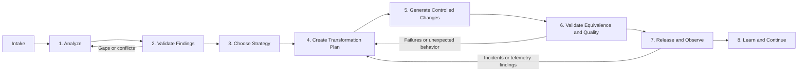

Below is the end-to-end process for a **legacy code transformation agent system**. It starts with a repository and whatever operational evidence is available, then progressively converts uncertainty into approved, validated code changes.

The output is not simply “modernized code.” It is a set of **safe, traceable transformation waves** that preserve agreed business behavior while improving maintainability, security, delivery speed, and operational reliability.



## 0. Intake and Access

**What happens**  
A person or workflow gives the system a defined analysis boundary. This step controls what the agents are allowed to inspect and what business outcome they are working toward.

**Input**

```yaml
repository:
  url: https://github.com/org/payment-platform
  ref: 4f8c123
  access: read-only

scope:
  include: [src/, database/, api/]
  exclude: [generated/, vendor/]

available_evidence:
  tests: [ci-results, test-reports]
  runtime: [traces, logs, metrics]
  documentation: [runbooks, API-specifications, architecture-diagrams]
  operations: [incident-summaries]

objectives:
  - Identify critical business capabilities.
  - Map dependencies and data flows.
  - Assess modernization risks and candidates.
  - Record evidence coverage and confidence per finding.
constraints:
  - No unapproved production changes.
  - Maximum five minutes planned downtime.
  - Payment data remains within approved regions.
```

**Output**

```yaml
accepted_intake:
  repository_revision: 4f8c123
  allowed_paths: [src/, database/, api/]
  available_evidence_sources: [ci-results, traces, runbooks]
  transformation_objectives: [...]
  constraints: [...]
  access_limit: read-only
```

**How it fits**  
This is the contract for all later work. It gives the analysis agent a repository, defines its limits, and identifies the evidence it may use. It does **not** claim that runtime evidence is good or that business rules are understood.

---

## 1. Analyze the Existing System

**What happens**  
The analysis agent inspects source code, configuration, database assets, tests, API definitions, build pipelines, and the supplied evidence. It identifies what exists and how it appears to work.

This agent is read-only. Its job is understanding, not changing code.

**Input**

- Accepted intake.
- Repository at the fixed revision.
- Permitted evidence sources: tests, logs, traces, documentation, incidents, deployment configuration.

**Work performed**

- Inventory applications, modules, jobs, APIs, databases, queues, and third-party dependencies.
- Map static dependencies from code and configuration.
- Identify entry points such as HTTP handlers, message consumers, command-line jobs, and scheduled tasks.
- Detect risk signals: unsupported runtimes, vulnerable dependencies, tight coupling, missing tests, duplicate logic, poor build health, and slow components.
- Extract candidate business rules from code, schema constraints, tests, APIs, configuration, runbooks, and logs.
- Identify critical business capabilities, for example payment authorization, refund processing, or daily settlement.

**Output**

```yaml
system_assessment:
  inventory:
    services: [...]
    modules: [...]
    databases: [...]
    integrations: [...]

  capabilities:
    - id: payment-authorization
      entry_points: [...]
      dependencies: [...]
      criticality: high

  candidate_business_rules:
    - id: refund-age-policy
      statement: "Refunds older than 30 days require manual review."
      evidence: [...]

  technical_risks:
    - id: unsupported-runtime
      location: src/
      severity: high

  evidence_gaps:
    - "No runtime evidence for refund processing."
    - "Settlement behavior lacks integration tests."
```

**How it fits**  
This replaces the vague instruction “modernize the legacy system” with a map of concrete capabilities, dependencies, risks, candidate rules, and unknowns.

---

## 2. Verify Evidence and Establish Confidence

**What happens**  
The evidence-validation agent checks whether the findings from analysis are adequately supported. It distinguishes:

- what the code *could* do,
- what tests *expect* it to do,
- what documentation *says* it should do,
- and what production evidence shows it *actually* does.

This is where `runtime evidence: partial` and `business-rule confidence: medium` are calculated.

**Input**

- `system_assessment` from Stage 1.
- Referenced source, test, documentation, runtime, deployment, and incident evidence.

**Work performed**

For each critical capability and candidate business rule:

- Verify that evidence is current and relates to the analyzed revision/environment.
- Compare code behavior with test expectations.
- Compare tests and code with API contracts, runbooks, and domain documentation.
- Check logs, traces, metrics, and incidents for observed real-world execution.
- Identify contradictions, for example a test permits retries while a runbook says retries must be blocked.
- Identify missing evidence that makes transformation unsafe.

**Output**

```yaml
validated_assessment:
  runtime_evidence:
    payment-authorization:
      status: strong
      sources: [traces, metrics, integration-tests]
    refunds:
      status: unavailable
      missing: [production-traces, recent-integration-tests]
    daily-settlement:
      status: partial
      sources: [scheduled-job-logs, incident-summaries]
      missing: [peak-load-data, reconciliation-evidence]

  business_rules:
    - id: refund-age-policy
      confidence:
        level: high
        score: 0.89
      supporting_evidence: [code, integration-test, API-contract, domain-policy]

    - id: settlement-retry-idempotency
      confidence:
        level: low
        score: 0.42
      supporting_evidence: [source-code]
      missing: [test, runtime-evidence, domain-owner-confirmation]

  blocking_questions:
    - "Can a settlement retry create a duplicate ledger entry?"
```

**How it fits**  
Later agents receive validated facts rather than unqualified inferences. A low-confidence rule becomes a discovery task, not an instruction for automated transformation.

A practical policy is:

| Confidence | What the system may do |
|---|---|
| High | Recommend a change, generate tests, and prepare a reviewable implementation. |
| Medium | Create characterization tests and ask focused domain questions before behavior-changing work. |
| Low / unknown | Do not transform the behavior; record a risk and request evidence or a human decision. |
| Conflicting | Block transformation of that capability until the conflict is resolved. |

---

## 3. Select a Modernization Strategy

**What happens**  
The strategy agent decides what type of modernization is appropriate for each capability or component. It does not apply one universal answer such as “convert the monolith to microservices.”

**Input**

- `validated_assessment`.
- Business priorities, budget/timeline, target platform, compliance constraints, and downtime tolerance from the intake.
- Human decisions for any blocking business-rule questions.

**Work performed**

- Rank components by business value, technical risk, coupling, cost, urgency, and confidence.
- Identify dependencies that constrain migration order.
- Choose a modernization approach for each area:
  - retain,
  - retire,
  - rehost,
  - replatform,
  - encapsulate behind an API,
  - refactor,
  - rearchitect,
  - replace.
- Select a pilot that is valuable but bounded enough to prove the approach.
- Propose target-state boundaries, data ownership, and integration contracts.

**Output**

```yaml
modernization_strategy:
  target_state:
    platform: managed-containers
    integration_style: versioned-HTTP-APIs

  component_decisions:
    - capability: payment-authorization
      strategy: encapsulate
      rationale: "High business value; stable internal logic; poor external integration."
      prerequisites: [versioned-contract, contract-tests]

    - capability: daily-settlement
      strategy: refactor
      rationale: "High incident rate and excessive coupling."
      blockers: [settlement-retry-idempotency]

  pilot:
    capability: payment-authorization
    success_criteria:
      - "No API behavior regression."
      - "Latency does not exceed baseline by more than 5%."
      - "Rollback proven in a non-production environment."

  decision_requests:
    - "Approve managed-container target platform."
```

**How it fits**  
This turns the assessment into a portfolio of deliberate decisions. Human architecture and business approval happens here, before code-changing agents begin.

---

## 4. Plan a Transformation Wave

**What happens**  
The planning agent turns one approved strategy into an executable, bounded piece of work. A transformation wave should deliver a capability or meaningful slice, not merely move arbitrary files.

**Input**

- Approved `modernization_strategy`.
- Validated system facts and business rules.
- Human-approved resolution of required decisions.
- Current repository revision and target environment standards.

**Work performed**

- Break work into small, reviewable changes.
- Define prerequisites, dependencies, ordering, risks, and fallback behavior.
- Create required characterization, unit, integration, contract, security, performance, and data-validation tests.
- Define feature flags, parallel-run scenarios, and rollback conditions.
- Define acceptance criteria and release evidence requirements.

**Output**

```yaml
transformation_wave:
  id: authorization-api-facade-v1
  objective: "Encapsulate payment authorization behind a stable API."

  preconditions:
    - "Authorization behavior characterized by regression tests."
    - "API contract approved."
    - "Feature-flag and rollback mechanisms available."

  change_steps:
    - "Add characterization tests for current authorization behavior."
    - "Create versioned authorization API facade."
    - "Route a controlled percentage of traffic through the facade."
    - "Compare response, error, and latency telemetry."

  acceptance_criteria:
    - "Existing contract tests pass."
    - "New facade matches approved behavior."
    - "No increase in authorization failure rate."
    - "Rollback completes within the agreed limit."

  approval_gate: required
```

**How it fits**  
The plan is the bridge between strategy and implementation. It converts a broad intent, such as “encapsulate authorization,” into an auditable sequence with tests, success criteria, and an explicit rollback path.

---

## 5. Generate Controlled Changes

**What happens**  
The transformation agent works only on an approved plan, usually in an isolated workspace and a new branch. It makes small changes and records exactly why each change was made.

**Input**

- Approved `transformation_wave`.
- Fixed repository revision.
- Code and evidence references for the applicable rules.
- Write permission limited to an isolated branch or workspace.

**Work performed**

- Add characterization tests before refactoring unknown behavior.
- Perform approved code transformations.
- Generate adapters, API facades, tests, build updates, configuration, and documentation.
- Run local validation after each bounded change.
- Produce a pull request or change proposal rather than merging directly.
- Stop and escalate when it encounters ambiguity, an unsupported dependency, a failing test it cannot explain, or a rule with insufficient confidence.

**Output**

```yaml
change_proposal:
  branch: agent/authorization-api-facade-v1
  changes:
    - path: src/api/AuthorizationFacade.java
      purpose: "Expose the approved authorization interface."
    - path: tests/AuthorizationCharacterizationTest.java
      purpose: "Capture existing behavior before routing changes."

  rule_traceability:
    - change: AuthorizationFacade
      rules: [authorization-response-contract, authorization-timeout-policy]

  validation_results:
    unit_tests: passed
    integration_tests: passed
    static_analysis: passed

  unresolved_items: []
  human_review: required
```

**How it fits**  
The agent produces reviewable implementation evidence. It does not independently decide to merge, deploy, discard failing tests, or reinterpret business behavior.

---

## 6. Validate Behavioral Equivalence and Quality

**What happens**  
The validation agent determines whether the proposed transformation preserves approved behavior and meets the new technical expectations.

**Input**

- `change_proposal`.
- Baseline behavior from characterization tests and prior runtime evidence.
- Test suites, contract definitions, performance baselines, security policies, and data-reconciliation rules.
- Where appropriate, parallel-run/shadow-traffic comparison results.

**Work performed**

- Run unit, integration, contract, end-to-end, and regression tests.
- Compare old and new responses, side effects, data writes, error handling, and retry behavior.
- Run security scans and dependency checks.
- Compare performance and reliability with agreed baselines.
- Perform data reconciliation for transformed data flows.
- Identify deviations and classify them as defect, approved change, or decision required.

**Output**

```yaml
release_readiness:
  status: ready-for-approved-rollout
  functional_equivalence:
    status: passed
    exceptions: []

  quality:
    tests: passed
    security: passed
    performance:
      status: passed
      p95_latency_change: "+2.1%"

  operational_readiness:
    feature_flag: verified
    rollback: verified
    monitoring: verified

  required_approvals:
    - engineering-owner
    - service-owner
```

**How it fits**  
This is the proof gate. A passing build alone is insufficient; the system needs behavioral, security, performance, data, and operational evidence before a release.

---

## 7. Release and Observe

**What happens**  
A release agent assists with controlled deployment, but people approve production actions. The system observes live behavior and uses it to decide whether to continue, hold, or recommend rollback.

**Input**

- Human-approved `release_readiness`.
- Deployment/runbook configuration.
- Feature-flag or canary-release controls.
- Monitoring, tracing, alerting, and rollback access.

**Work performed**

- Prepare a deployment or pull-request release package.
- Enable a feature flag, canary, or parallel operation only after approval.
- Monitor errors, latency, throughput, dependency failures, business outcomes, and data consistency.
- Compare results with pre-defined thresholds.
- Recommend promotion, pause, investigation, or rollback.

**Output**

```yaml
release_observation:
  rollout_status: canary-complete
  traffic_percentage: 10
  observations:
    error_rate_change: "-0.03%"
    p95_latency_change: "+1.8%"
    data_reconciliation: passed
  recommendation: promote-to-25-percent
  decision_required_from: service-owner
```

**How it fits**  
Production evidence improves the agent’s understanding of actual behavior and supplies stronger evidence for subsequent migration waves.

---

## 8. Learn, Decommission, and Continue

**What happens**  
The system records what changed, what was learned, what remains risky, and which temporary bridges must be retired. It updates the overall modernization roadmap rather than treating each release as isolated work.

**Input**

- Release observations.
- Incident reports, support feedback, reviewer feedback, and accepted/rejected decisions.
- Remaining strategy and transformation backlog.

**Work performed**

- Update dependency and capability maps.
- Record newly confirmed business rules and resolved contradictions.
- Update evidence coverage and confidence ratings.
- Track progress against modernization outcomes.
- Create follow-up work for temporary adapters, legacy infrastructure, licenses, unused services, and documentation debt.
- Reprioritize the next transformation wave.

**Output**

```yaml
modernization_portfolio_update:
  completed_capability: payment-authorization-api-facade
  confirmed_rules: [authorization-response-contract]
  newly_discovered_risks:
    - "Fraud adapter timeout causes fallback behavior not covered by tests."

  decommission_candidates:
    - "Legacy direct authorization endpoint after full traffic migration."

  next_recommended_wave:
    capability: refunds
    prerequisite: "Collect production trace coverage and add contract tests."
```

**How it fits**  
This closes the loop. The next analysis and planning cycle starts with more reliable evidence, fewer unknowns, and an updated roadmap.

## The Complete Chain

```text
Repository + constraints + permitted evidence
  -> Analysis: discover the system and candidate rules
  -> Evidence validation: determine what is known, unknown, and contradictory
  -> Strategy: choose what to modernize and how
  -> Planning: define an approved, reversible transformation wave
  -> Transformation: generate a traceable change proposal
  -> Validation: prove approved behavior and quality expectations
  -> Release: roll out gradually and observe actual behavior
  -> Learning: update the evidence base, roadmap, and next wave
```

Each stage produces an explicit artifact that becomes the next stage’s input. The transformation agent is therefore constrained by validated evidence and approved plans, rather than being asked to interpret a repository and directly rewrite it.
