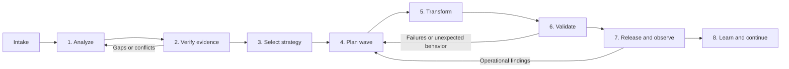

Modernizing legacy code safely requires more than generating replacement code. The
agent system converts a repository and permitted evidence into small, approved,
validated transformation waves. Each stage produces a traceable artifact for the
next stage, so agents do not make unsupported assumptions about business behavior.

## Lifecycle At A Glance



The system aims to preserve agreed business behavior while reducing the technical,
operational, and security constraints that make the legacy estate difficult to
change. Human owners retain authority over business rules, architecture, and
production releases.

## Stage Contracts

| Stage | What happens | Input | Output | How it advances the work |
|-------|--------------|-------|--------|--------------------------|
| 0. Intake and access | Establishes the repository revision, analysis boundary, permitted evidence, objectives, constraints, and access limits | Repository reference, fixed revision, scope, credentials, business objectives, constraints, approved evidence sources | Accepted intake contract | Gives every agent a shared, constrained boundary; it does not assert that behavior is understood or evidence is sufficient |
| 1. Analyze the existing system | Creates an inventory of code, integrations, data assets, entry points, dependencies, risks, capabilities, and candidate rules | Accepted intake, repository, permitted source, test, documentation, operational, and runtime evidence | System assessment | Converts an unstructured codebase into capabilities, dependencies, risks, candidate rules, and known evidence gaps |
| 2. Verify evidence and establish confidence | Checks whether findings are supported, current, direct, and consistent across code, tests, documentation, and runtime evidence | System assessment and referenced evidence | Validated assessment | Separates observed or corroborated facts from hypotheses, gaps, and contradictions before strategy or code changes begin |
| 3. Select a modernization strategy | Chooses a suitable strategy per capability, such as retain, retire, rehost, replatform, encapsulate, refactor, rearchitect, or replace | Validated assessment, business priorities, target direction, human decisions, and constraints | Modernization strategy and pilot proposal | Translates technical findings into approved, ordered portfolio decisions rather than applying a single approach everywhere |
| 4. Plan a transformation wave | Defines a small, reversible, business-capability-oriented implementation sequence with tests, rollout, rollback, risks, and acceptance criteria | Approved strategy, validated rules, repository revision, target standards | Approved transformation wave | Makes the strategy executable and creates the only authorized scope for a code-changing agent |
| 5. Generate controlled changes | Produces small, traceable changes in an isolated branch or workspace; adds characterization tests before changing uncertain behavior | Approved transformation wave, fixed revision, applicable rules and evidence, restricted write access | Change proposal with validation evidence | Provides a reviewable implementation candidate, not an automatic merge or production deployment |
| 6. Validate equivalence and quality | Verifies functional behavior, integration contracts, data consistency, performance, security, and operational readiness | Change proposal, baselines, tests, contracts, scan policies, reconciliation rules, and comparison data | Release-readiness assessment | Supplies proof that the change preserves approved behavior and meets quality thresholds |
| 7. Release and observe | Supports approved feature-flag, canary, or parallel rollout and compares live results with defined thresholds | Approved release readiness, deployment controls, monitoring, tracing, alerting, and rollback capability | Release observation and promotion, hold, or rollback recommendation | Produces live operational evidence and prevents a passing build from being treated as sufficient release proof |
| 8. Learn, decommission, and continue | Updates the capability map, confidence ratings, known risks, transformation backlog, and retirement work | Release observation, incidents, support feedback, reviewer decisions, and remaining roadmap | Modernization portfolio update | Closes the loop and makes the next wave better informed than the previous one |

## Intake And Analysis

The first agent receives an intake that describes what it may inspect. Runtime
evidence coverage and business-rule confidence are assessment outputs, not user
supplied labels.

```yaml
repository:
  url: https://github.com/org/payment-platform
  ref: 4f8c123
  access: read-only

scope:
  include: [src/, database/, api/]
  exclude: [generated/, vendor/]

available_evidence:
  tests: [ci-results, test-reports]
  runtime: [traces, logs, metrics]
  documentation: [runbooks, api-specifications, architecture-diagrams]
  operations: [incident-summaries]

objectives:
  - Preserve payment and refund behavior
  - Reduce settlement production incidents
  - Modernize unsupported dependencies

constraints:
  - No unapproved production changes
  - Maximum five minutes planned downtime
```

The analysis agent uses this boundary to identify entry points, capabilities,
dependencies, candidate business rules, and technical risks. It must retain evidence
references for each meaningful conclusion.

```yaml
system_assessment:
  capabilities:
    - id: payment-authorization
      entry_points: [api/authorization]
      dependencies: [fraud-adapter, ledger]
      criticality: high
  candidate_business_rules:
    - id: refund-age-policy
      statement: Refunds older than 30 days require manual review.
      evidence: [source, integration-test, api-contract]
  evidence_gaps:
    - No runtime evidence for refund processing.
```

## Evidence And Confidence

Source code shows intended or possible behavior. Runtime evidence shows behavior
that has actually occurred. The evidence-validation stage classifies coverage for
each critical capability instead of applying an imprecise repository-wide label.

| Evidence source | What it establishes |
|-----------------|---------------------|
| Production traces | Observed request paths, calls, latency, errors, and dependencies |
| Structured logs and audit records | Executed jobs, exceptions, retries, edge cases, and operational events |
| Metrics | Traffic, throughput, latency distribution, saturation, and failure rate |
| Tests | Expected behavior for the covered scenarios |
| Deployment configuration | Current topology, versions, and runtime dependencies |
| Incident records | Real failure modes and operational workarounds |
| Database evidence | Schema constraints, data quality, and access patterns |

For each capability, the agent checks whether evidence is recent, representative,
related to the analyzed deployment, and covers normal and failure paths. The result
is explicit about gaps.

```yaml
runtime_evidence:
  payment-authorization:
    status: strong
    sources: [traces, metrics, integration-tests]
  refunds:
    status: unavailable
    missing: [production-traces, recent-integration-tests]
  daily-settlement:
    status: partial
    sources: [scheduled-job-logs, incident-summaries]
    missing: [peak-load-data, reconciliation-evidence]
```

A business-rule confidence rating is an evidence score for a specific, testable
statement, not a model's assertion that it understands the code. A rule reaches
high confidence when independent evidence agrees, such as source code, tests,
contracts or policy, runtime behavior, and a domain-owner confirmation.

| Confidence | Allowed agent action |
|------------|----------------------|
| High | Propose a change, generate tests, and prepare a reviewable implementation |
| Medium | Add characterization tests and request a focused domain decision before behavior-changing work |
| Low or unknown | Do not transform the behavior; record a gap and request further evidence |
| Conflicting | Block transformation of the capability until the conflict is resolved |

```yaml
business_rules:
  - id: settlement-retry-idempotency
    statement: Settlement retries must not create duplicate ledger entries.
    confidence:
      level: medium
      score: 0.72
    evidence: [source, schema-constraint, unit-test]
    missing: [recent-production-retry-trace, domain-owner-confirmation]
```

## Transformation And Release Controls

Only an approved transformation wave grants a code-changing agent permission to
act. The agent works in a branch or isolated workspace, generates bounded changes,
and reports all validation results and unresolved questions in a change proposal.

```text
Accepted intake
  -> System assessment
  -> Validated assessment
  -> Approved modernization strategy
  -> Approved transformation wave
  -> Change proposal
  -> Release-readiness assessment
  -> Release observation
  -> Modernization portfolio update
```

Human approval is required before selecting or changing the target architecture,
treating inferred business rules as authoritative, changing data migration or
retention behavior, bypassing validation, merging broad changes, or performing a
production promotion or rollback.

## Example Transformation Wave

The planning stage defines the smallest meaningful release unit. The following
example encapsulates payment authorization behind a stable API rather than
attempting to rewrite an entire application at once.

```yaml
transformation_wave:
  id: authorization-api-facade-v1
  objective: Encapsulate payment authorization behind a stable API.
  preconditions:
    - Characterization tests define current authorization behavior.
    - The API contract is approved.
    - Feature-flag and rollback mechanisms are verified.
  change_steps:
    - Add characterization tests.
    - Create the versioned authorization API facade.
    - Route controlled traffic through the facade.
    - Compare response, error, and latency telemetry.
  acceptance_criteria:
    - Existing contract tests pass.
    - The facade matches approved behavior.
    - Authorization failure rate does not increase.
    - Rollback completes within the agreed limit.
  approval_gate: required
```

This structure lets the organization make measurable progress while retaining a
clear decision trail from each production change back to its business objective,
approved plan, rule evidence, validation result, and release observation.
